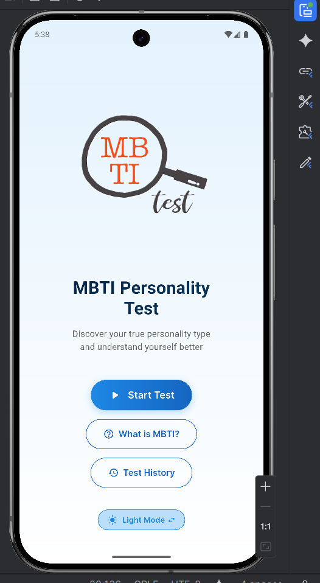
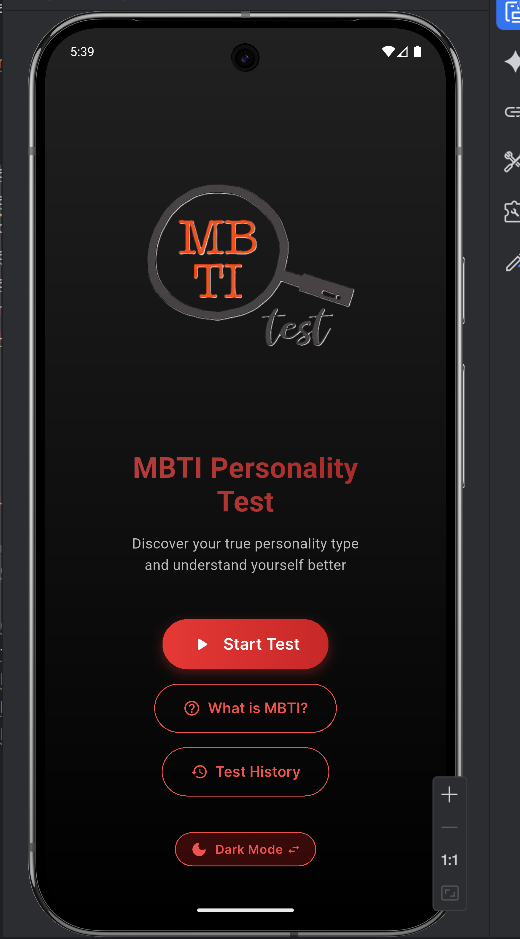
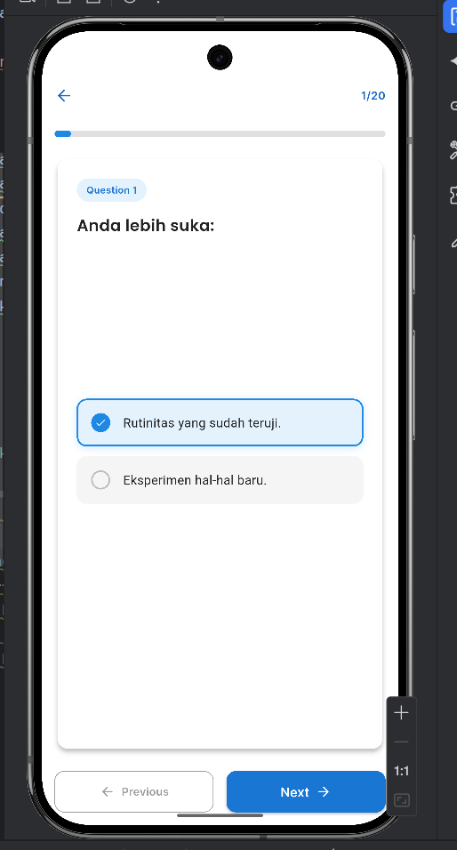
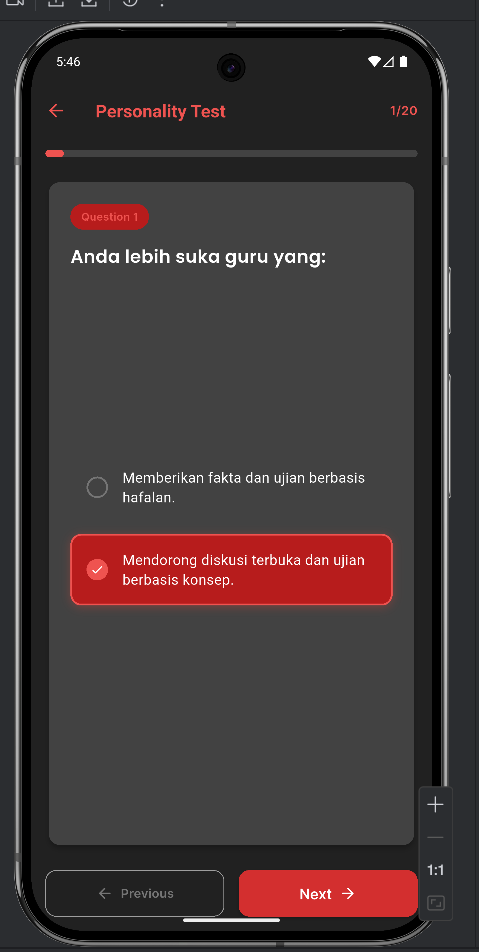
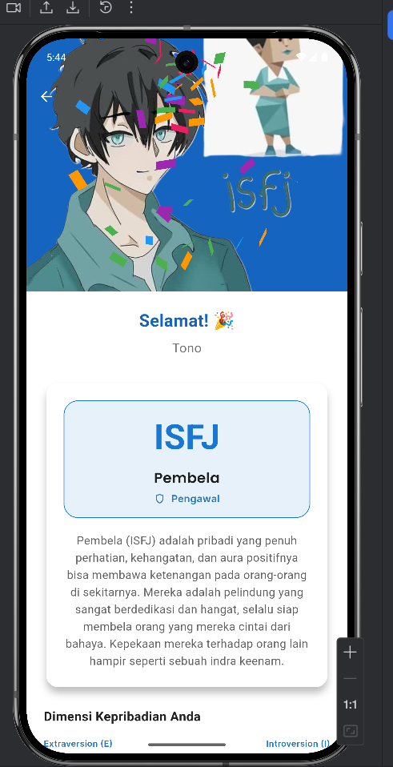
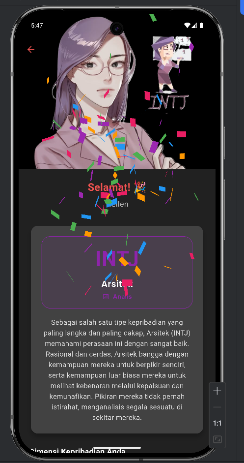
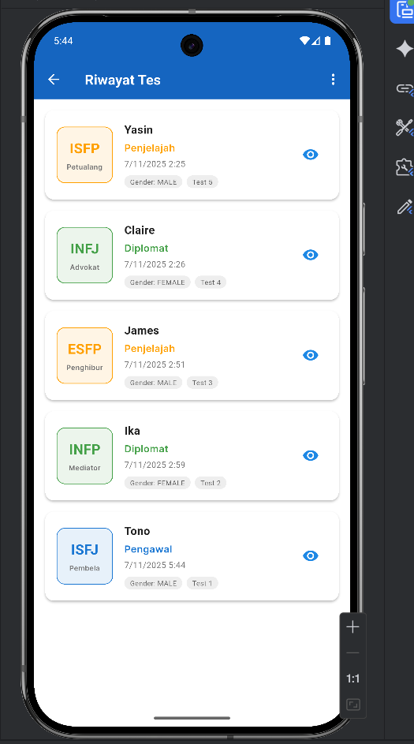

# PersonaTest - Aplikasi Tes Kepribadian MBTI

Sebuah aplikasi kuis MBTI yang dibangun menggunakan Flutter sebagai pemenuhan Ujian Tengah Semester (UTS).

## 👤 Data Diri

* **Nama:** Albert Sanggam Nalom Sinurat
* **NIM:** 231401034
* **Lab:** PM 1 (Pemrograman Mobile 1)

---

## 📝 Deskripsi Aplikasi

**PersonaTest** adalah aplikasi kuis pilihan ganda yang dirancang untuk membantu pengguna menemukan tipe kepribadian MBTI (Myers-Briggs Type Indicator) mereka. Aplikasi ini dibuat untuk memenuhi tugas UTS Lab Pemrograman Mobile 1 (PM1) Semester Ganjil T.A.2025/2026.
Pengguna dapat memasukkan nama, memilih gender (untuk avatar), menjawab 20 pertanyaan yang dipilih secara acak dari bank soal, dan langsung melihat halaman hasil yang mendetail Aplikasi ini juga dilengkapi dengan fitur riwayat tes, dual-theme (Light/Dark mode), dan fungsionalitas untuk menghapus data riwayat.

### ✨ Fitur Utama
* **Tes 20 Soal:** Menggunakan 5 pertanyaan acak per dikotomi (dari total 100 bank soal).
* **16 Tipe Kepribadian:** Halaman hasil yang kaya dan mendetail untuk semua 16 tipe.
* **Avatar Dinamis:** Gambar hasil (avatar) menyesuaikan dengan gender yang dipilih pengguna.
* [cite_start]**Dual-Theme:** Mendukung Light Mode dan Dark Mode secara penuh[cite: 28].
* **Riwayat Tes:** Menyimpan semua hasil tes sebelumnya secara lokal di perangkat.
* **Manajemen Riwayat:** Pengguna dapat menghapus semua riwayat sekaligus atau menghapus satu per satu.
* **Animasi & Haptic:** Dilengkapi animasi *loading*, *fade-in*, *slide-in*, *confetti* di halaman hasil, dan *haptic feedback* untuk UX yang lebih baik.
* **Fitur Berbagi:** Pengguna dapat membagikan hasil tes mereka ke aplikasi lain.

---

## 📸 Tampilan Aplikasi (Screenshot)

[cite_start](Sesuai dengan kriteria `e. Screenshot/Video Aplikasi` [cite: 67])

| Welcome Screen (Light) | Welcome Screen (Dark)|              Input Nama               |
| :---: | :---: |:-------------------------------------:|
|  | |                |
| **Quiz Screen (Light)** | **Quiz Screen (Dark)** |       **Result Screen (Light)**       |
|  | |    |
| **Result Screen (Dark)** | **History Screen (Light)** |      **History Screen (Empty)**       |
| [ |  |  |

---

## 🎨 Mockup / Prototype (Figma)

Seluruh desain dan prototipe aplikasi ini dibuat menggunakan Canva.

* **https://www.canva.com/design/DAG395q3P34/ySG525glfCwfb76VN12Qcw/edit?utm_content=DAG395q3P34&utm_campaign=designshare&utm_medium=link2&utm_source=sharebutton**

---

## 📚 Aset & Referensi (Credit)

* **Konten & Avatar MBTI:** Seluruh data deskripsi, ciri-ciri, saran karir, dan gambar avatar kepribadian diambil dari [16Personalities.com](https://www.16personalities.com/id/tipe-kepribadian).
* **Avatar MBTI :**Diambil dari Berbagai link Pinterest.
* **Logo Aplikasi:** `https://www.google.com/url?sa=i&url=https%3A%2F%2Fwww.freepik.com%2Fpremium-vector%2Fmyersbriggs-type-indicator-mbti-psychological-test-introversion-extraversion-feeling-judging-etc_33440073.htm&psig=AOvVaw2_qjqIZg-m59byi7OEHXAf&ust=1762555802033000&source=images&cd=vfe&opi=89978449&ved=0CBUQjRxqFwoTCNjw75XO3pADFQAAAAAdAAAAABAE`
* **Font dan Icon:** [Google Fonts](https://fonts.google.com/) (Menggunakan font Poppins dan Inter).
* **Manajemen State:** [Provider](https://pub.dev/packages/provider).
* **Penyimpanan Lokal:** [shared_preferences](https://pub.dev/packages/shared_preferences).
* **Animasi Konfeti:** [confetti](https://pub.dev/packages/confetti).
* **Fitur Berbagi:** [share_plus](https://pub.dev/packages/share_plus).
* **Haptic Feedback:** [vibration](https://pub.dev/packages/vibration).